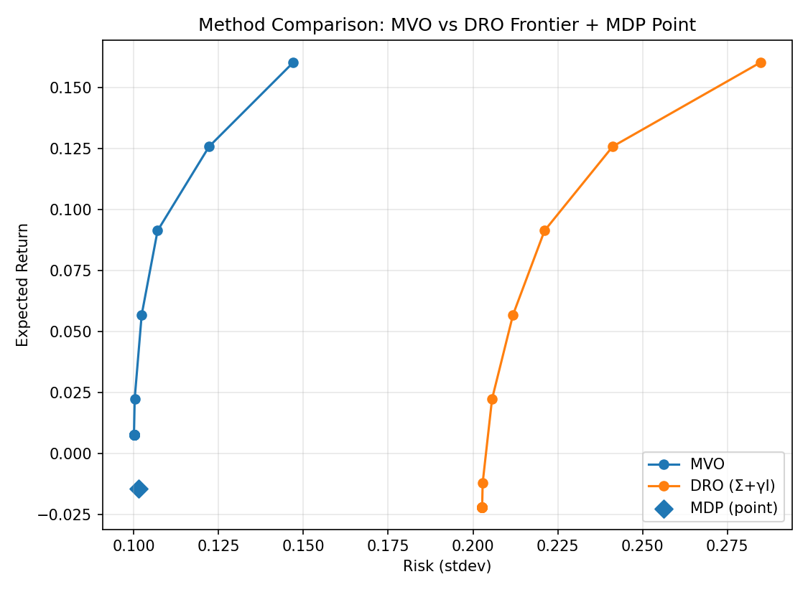

Method Comparison
=================

Setup
-----
- Synthetic 5-asset universe (GBM-derived log returns).
- Annualized estimates :math:`(\hat{\mu}, \hat{\Sigma})`.
- Long-only, fully invested.

What We Compare
---------------
- **MVO** frontier (risk vs return), with CML and tangency point.
- **DRO** frontier (using :math:`\Sigma' = \Sigma + \gamma I`).
- **MDP** as a single portfolio (closed-form point; not a frontier).

Comparison Figure
-----------------

   MVO and DRO frontiers contrasted. MDP appears as a single point.

Per-Method Figures (Optional)
-----------------------------

.. figure:: _static/artifacts/v2/dro_frontier.png
   :alt: DRO frontier (Σ + γ I)
   :width: 70%
   :align: center

.. figure:: _static/artifacts/v2/mdp_point.png
   :alt: Most Diversified Portfolio (point)
   :width: 55%
   :align: center

Key Takeaways
-------------
- **MVO** achieves the best frontier under precise estimates but can be brittle to estimation error.
- **DRO** generally shifts the frontier downward but can reduce sensitivity to misspecification; :math:`\gamma` controls robustness.
- **MDP** tends to produce smoother, more diversified exposures; here we present the standard closed-form solution as a single point.
