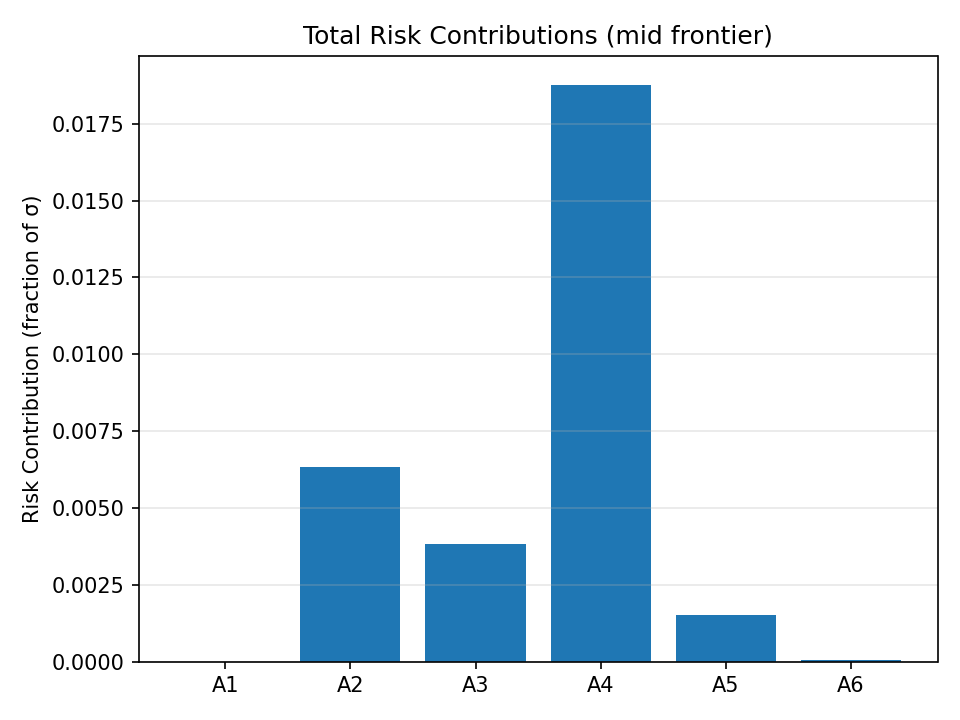

Visualization
=============

Efficient Frontier (Real)
-------------------------

.. image:: _static/artifacts/v0/frontier.png
   :alt: Efficient Frontier
   :align: center
   :width: 720px

Efficient Frontier + Capital Market Line
----------------------------------------

.. image:: _static/artifacts/v0/frontier.png
   :alt: Efficient Frontier (CML drawn by code sample)
   :align: center
   :width: 720px

Weights Along the Frontier (Real)
---------------------------------

.. image:: _static/artifacts/v0/weights.png
   :alt: Weights Along the Frontier
   :align: center
   :width: 720px

Risk Contributions (Real)
-------------------------

How to generate these artifacts
-------------------------------

We generate these files with a real qpfolio run (OSQP-backed) via:

.. code-block:: bash

   make docs-artifacts

See ``scripts/generate_docs_artifacts.py`` for the exact steps and parameters.
