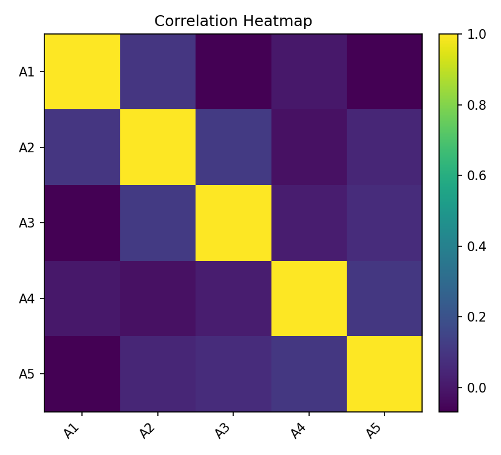
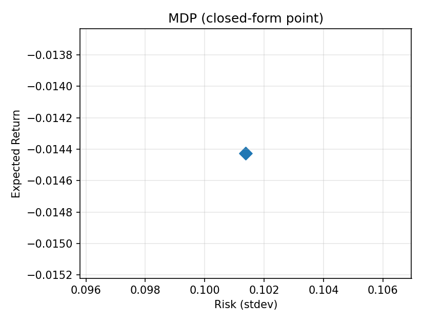

Visualization
=============

This page shows the core visuals produced by a real OSQP-backed run.
All files are pre-generated and committed so Read the Docs can display them deterministically.

Data Generation (GBM)
---------------------

.. figure:: _static/artifacts/v1/gbm_prices.png
   :alt: Simulated GBM price paths
   :align: center
   :width: 85%

   Simulated GBM price trajectories for five assets over one year.

.. figure:: _static/artifacts/v1/gbm_returns.png
   :alt: GBM log returns (annualized)
   :align: center
   :width: 85%

   Log returns derived from GBM prices (shown annualized for visual scale).

Efficient Frontier + Capital Market Line (MVO)
----------------------------------------------

.. figure:: _static/artifacts/v2/mvo_frontier.png
   :alt: MVO Efficient Frontier with Capital Market Line
   :align: center
   :width: 80%

   Efficient frontier under MVO with the Capital Market Line (CML) and tangency portfolio.

Weights Along the Frontier (MVO)
--------------------------------

.. figure:: _static/artifacts/v2/mvo_weights.png
   :alt: Portfolio weights along the efficient frontier
   :align: center
   :width: 80%

   Stacked weights as the target return increases (left → right). Higher-return frontier points tend to overweight higher-risk assets.

Risk Contributions (MVO, mid frontier)
--------------------------------------

.. figure:: _static/artifacts/v2/mvo_risk.png
   :alt: Risk contributions at a representative frontier point
   :align: center
   :width: 70%

   Each bar shows the contribution of an asset to total portfolio risk at a mid-frontier portfolio.

Correlation Heatmap
-------------------

   Pairwise correlations estimated from the simulated returns.

DRO Frontier (Σ + γI)
---------------------

.. figure:: _static/artifacts/v2/dro_frontier.png
   :alt: DRO frontier (Σ + γI)
   :align: center
   :width: 75%

   Distributionally robust frontier using Σ′ = Σ + γI (γ controls robustness level).

MDP (Most Diversified Portfolio)
--------------------------------

   The MDP is shown as a single portfolio (closed-form approximation) rather than a frontier.

How to Re-generate These Artifacts (local)
------------------------------------------

.. code-block:: bash

   # from repository root
   PYTHONPATH=. python doc/scripts/generate_visualizations_v1.py --seed 42
   PYTHONPATH=. python doc/scripts/generate_visualizations_v2.py --seed 42 --gamma 0.15

The v1 script produces GBM visuals; the v2 script produces the MVO/DRO/MDP visuals.
Commit the resulting ``doc/_static/artifacts/v1`` and ``v2`` folders so RTD can display them.
